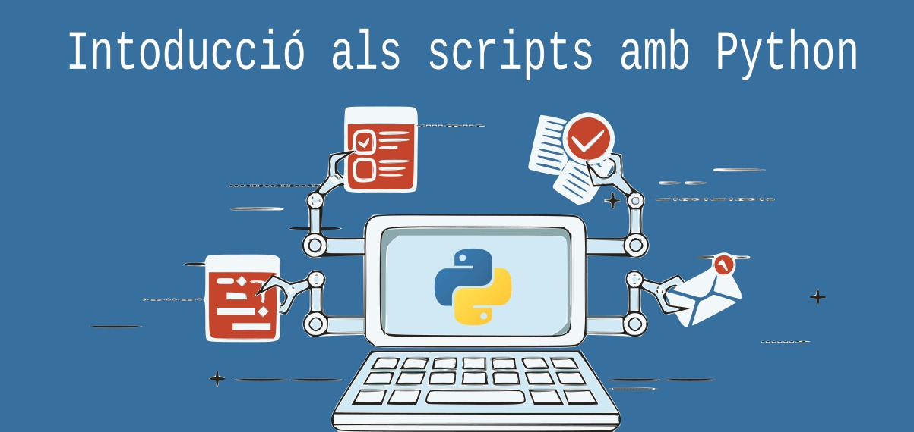

<style>
</style>
---


# Python?

És el llenguatge de programació més utilitzat actualment segons el rànquing TIOBE.  
Àmpliament utilitzat en Ciberseguretat, IA i Administració de sistemes.

# Característiques

- Interpretat
- Identat
- Tipat (fort i dinàmic)

---

# Instal·lació

A les distribucions Linux ja ve instal·lat.
```bash
sudo apt install python3
```

> Hi ha dos versions de python no compatibles entre elles, python 2 i python 3. Python 2 s'està abandonant ja.

Per comprovar si està instal·lat:

```bash
python3 --version
```

---

# PIP
Per a gestionar paquets que acompanyen a python3 necessitem també pip, el *Package Installer for Python*.

```bash
sudo apt install python3-pip
```

Per comprovar si el tenim instal·lat:
```bash
pip --version
```
**Utilitzarem pip install *lliberira* per instal·lar dependències.**

----

# Scripts de python

Els script de python solen tindre l'extensió .py o .pyc (en cas d'estar compilats).

---
# Scripts de python 
Com també fem amb els scripts de Bash, necessitem indicar qui interpretarà l'script que programem.

```python
#!/usr/bin/env python3
```

---


# Hola món amb python
```python
#!/usr/bin/env python3
print('Hola món')
```

Print és equivalent a echo en bash.

```bash
#!/bin/bash
echo "Hola món"
```

---

# Tres formes d'execució de python

1. Com a script (./script.sh) -> Necessita permissos d'execució
2. Amb l'IDE (vscode) -> F5 per a depurar
3. Amb l'interpret (python3 script.sh)

## Activitat 1

Fes l'hola món i executa'l de les tres formes.

---


# Arguments d'entrada a l'script

El primer que fem és importar la biblioteca *sys*.

Després podem accedir a cada argument utilitzant sys.argv.

$1 serà sys.argv[1]
...

```python
#!/usr/bin/env python3
import sys

print(f'Hola {sys.argv[1]}')
```
Execució:
```bash
$ python3 saluda.py Ferran
Hola Ferran
```

---


# La llibreria argparse

Amb l'ús d'aquesta llibreria no cal anar comprovant si ens han passat els arguments correctes.

```python
#!/usr/bin/env python3
import argparse
parser = argparse.ArgumentParser()
parser.add_argument("-n", "--name", required=True)
args = parser.parse_args()
print(f'Hola {args.name} , benvingut! ')
```
Execució:
```python
$ python3 saluda_argsparse.py -n Ferran
Hola Ferran , benvingut!
$ python3 saluda_argsparse.py -h
usage: saluda_argsparse.py [-h] -n NAME

optional arguments:
  -h, --help            show this help message and exit
  -n NAME, --name NAME
```

---

# Tipus

En bash tot són cadenes de text, però python pot diferenciar entre molts tipus de dades, i segons el tipus, executar-se d'una forma o una altra.

Segons els nostres interessos utilitzarem un tipus o un altre de dades.

---

# if

Les estructures de control són les mateixes que en bash, però la seua sintaxi es simplifica.

```python
#!/usr/bin/env python3
import sys
if int(sys.argv[1]) > 0:
    print('Positiu')
else:
    print('Negatiu')
```

---

# for

```python
#!/usr/bin/env python3
fruits = ["apple", "banana", "cherry"]
for x in fruits:
  print(x)

for i in range(0,10,2):
    print(i)
```

---

# Input

És el que en bash és read. Demana informació a l'usuari.
```python
#!/usr/bin/env python3
nom = input('Dis-me el teu nom: ')
print(f'Hola {nom} , benvingut! ')
```

---

# Funcions
```python
#!/usr/bin/env python3
def multiplica(a, b):
    return float(a) * float(b)


def main():
    a = input('Dona\'m un número: ')
    b = input('Dona\'m un altre: ')
    res = multiplica(a, b)
    print(f'La multiplicació és {res}')


if __name__ == '__main__':
    main()
```

---

# Execució de comandaments de linux des de python
Utilitzem la llibreria *subprocess* per a utilitzar comandaments bash des de python.

```python
#!/usr/bin/env python3
import subprocess

subprocess.run(['ls', '-la'])
```
---

# Activitat final
Fes una calculadora que puga sumar, restar, multiplicar i dividir. Li demanarà al usuari quina operació vol fer i seguidament els operands. Després imprimirà el resultat per pantalla.